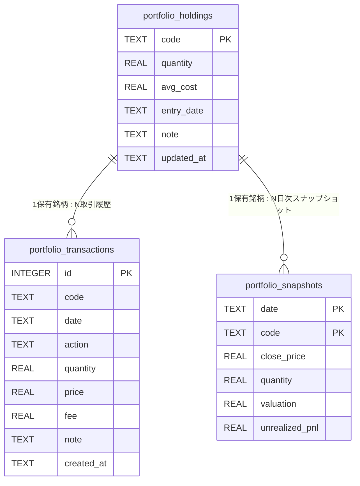

# ER図 — nkflow データベーススキーマ

## stocks.db

```mermaid
erDiagram

    %% ========== マスタ ==========
    stocks {
        TEXT code PK
        TEXT name
        TEXT sector
    }

    %% ========== 日次価格データ ==========
    daily_prices {
        TEXT code PK,FK
        TEXT date PK
        REAL open
        REAL high
        REAL low
        REAL close
        INTEGER volume
        REAL return_rate
        REAL price_range
        REAL range_pct
        REAL relative_strength
    }

    %% ========== グラフ分析結果 ==========
    graph_causality {
        TEXT source PK
        TEXT target PK
        INTEGER lag_days
        REAL p_value
        REAL f_stat
        TEXT period PK
        TEXT calc_date PK
    }

    graph_correlations {
        TEXT stock_a PK
        TEXT stock_b PK
        REAL coefficient
        TEXT period PK
        TEXT calc_date PK
    }

    graph_fund_flows {
        TEXT sector_from PK
        TEXT sector_to PK
        REAL volume_delta
        REAL return_spread
        TEXT date PK
    }

    graph_communities {
        TEXT code PK,FK
        INTEGER community_id
        TEXT calc_date PK
    }

    %% ========== 予測シグナル ==========
    signals {
        INTEGER id PK
        TEXT date
        TEXT signal_type
        TEXT code FK
        TEXT sector
        TEXT direction
        REAL confidence
        TEXT reasoning
        TEXT created_at
    }

    signal_results {
        INTEGER signal_id PK,FK
        INTEGER horizon_days PK
        TEXT eval_date
        REAL actual_return
        TEXT result
        TEXT created_at
    }

    signal_accuracy {
        TEXT signal_type PK
        INTEGER horizon_days PK
        TEXT calc_date PK
        INTEGER total_signals
        INTEGER hits
        REAL hit_rate
        REAL avg_return
    }

    %% ========== 信用残高・為替 ==========
    margin_balances {
        TEXT code PK,FK
        TEXT week_date PK
        REAL margin_buy
        REAL margin_sell
        REAL margin_ratio
        REAL buy_change
        REAL sell_change
        TEXT created_at
    }

    exchange_rates {
        TEXT date PK
        TEXT pair PK
        REAL open
        REAL high
        REAL low
        REAL close
        REAL change_rate
        REAL ma20
    }

    %% ========== 日次サマリ ==========
    daily_summary {
        TEXT date PK
        REAL nikkei_close
        REAL nikkei_return
        TEXT regime
        TEXT top_gainers
        TEXT top_losers
        INTEGER active_signals
        TEXT sector_rotation
    }

    %% ========== 市場圧力指標 (Phase 16) ==========
    margin_trading_weekly {
        TEXT week_date PK
        TEXT market_code PK
        REAL margin_buy_balance
        REAL margin_sell_balance
        REAL margin_ratio
        REAL lending_buy_balance
        REAL lending_sell_balance
        REAL pl_ratio_proxy
    }

    market_pressure_daily {
        TEXT date PK
        REAL pl_ratio
        TEXT pl_zone
        REAL buy_growth_4w
        REAL margin_ratio
        REAL margin_ratio_trend
        TEXT signal_flags
    }

    %% ========== バックテスト (Phase 14) ==========
    backtest_runs {
        INTEGER id PK
        TEXT name
        TEXT signal_type
        TEXT from_date
        TEXT to_date
        INTEGER holding_days
        TEXT direction_filter
        REAL min_confidence
        TEXT created_at
    }

    backtest_trades {
        INTEGER id PK
        INTEGER run_id FK
        INTEGER signal_id FK
        TEXT code
        TEXT signal_date
        TEXT entry_date
        TEXT exit_date
        REAL entry_price
        REAL exit_price
        REAL return_rate
        TEXT direction
    }

    backtest_results {
        INTEGER run_id PK,FK
        INTEGER total_trades
        INTEGER winning_trades
        REAL win_rate
        REAL avg_return
        REAL total_return
        REAL max_drawdown
        REAL sharpe_ratio
        TEXT calc_date
    }

    %% ========== セクターローテーション (Phase 17) ==========
    sector_daily_returns {
        TEXT date PK
        TEXT sector PK
        REAL return_rate
        INTEGER stock_count
    }

    sector_weekly_returns {
        TEXT week_date PK
        TEXT sector PK
        REAL return_rate
        INTEGER rank
    }

    sector_monthly_returns {
        TEXT month_date PK
        TEXT sector PK
        REAL return_rate
        INTEGER rank
    }

    sector_rotation_states {
        TEXT period_date PK
        TEXT period_type PK
        TEXT cluster_method PK
        INTEGER state_id
        TEXT state_name
        TEXT centroid_top_sectors
    }

    sector_rotation_transitions {
        INTEGER from_state PK
        INTEGER to_state PK
        TEXT period_type PK
        TEXT cluster_method PK
        REAL probability
        INTEGER count
        TEXT calc_date
    }

    sector_rotation_predictions {
        INTEGER id PK
        TEXT calc_date
        INTEGER current_state_id
        TEXT current_state_name
        INTEGER predicted_state_id
        TEXT predicted_state_name
        REAL confidence
        TEXT top_sectors
        TEXT all_probabilities
        REAL model_accuracy
    }

    %% ========== ニュース (Phase 18) ==========
    news_articles {
        TEXT id PK
        TEXT published_at
        TEXT source
        TEXT source_name
        TEXT title
        TEXT title_ja
        TEXT url
        TEXT language
        TEXT image_url
        TEXT tickers_json
        REAL sentiment
        TEXT category
        TEXT created_at
    }

    news_ticker_map {
        TEXT article_id PK,FK
        TEXT ticker PK
    }

    %% ========== 米国主要株価指数 (Phase 20) ==========
    us_indices {
        TEXT date PK
        TEXT ticker PK
        TEXT name
        REAL open
        REAL high
        REAL low
        REAL close
        INTEGER volume
    }

    %% ========== TD Sequential (Phase 22) ==========
    td_sequential {
        TEXT code PK,FK
        TEXT date PK
        INTEGER setup_bull
        INTEGER setup_bear
        INTEGER countdown_bull
        INTEGER countdown_bear
    }

    %% ========== リレーションシップ ==========
    stocks ||--o{ daily_prices : "1銘柄 : N日次価格"
    stocks ||--o{ margin_balances : "1銘柄 : N信用残高"
    stocks ||--o{ signals : "1銘柄 : Nシグナル (nullable)"
    stocks ||--o{ graph_communities : "1銘柄 : Nコミュニティ割当"

    signals ||--o{ signal_results : "1シグナル : N評価結果"
    signals ||--o{ backtest_trades : "1シグナル : Nバックテスト取引"

    backtest_runs ||--o{ backtest_trades : "1バックテスト実行 : N取引"
    backtest_runs ||--|| backtest_results : "1実行 : 1集計結果"

    news_articles ||--o{ news_ticker_map : "1記事 : N銘柄タグ"
    stocks ||--o{ td_sequential : "1銘柄 : N TD Sequential"
```

---

## portfolio.db (別ファイル)

---

## テーブルグループ一覧

| グループ | テーブル | DB |
|---|---|---|
| マスタ | `stocks` | stocks.db |
| 日次価格 | `daily_prices` | stocks.db |
| グラフ分析 | `graph_causality`, `graph_correlations`, `graph_fund_flows`, `graph_communities` | stocks.db |
| シグナル | `signals`, `signal_results`, `signal_accuracy` | stocks.db |
| 信用残高 | `margin_balances`, `margin_trading_weekly` | stocks.db |
| 為替 | `exchange_rates` | stocks.db |
| 市場圧力 | `market_pressure_daily` | stocks.db |
| 日次サマリ | `daily_summary` | stocks.db |
| バックテスト | `backtest_runs`, `backtest_trades`, `backtest_results` | stocks.db |
| セクターローテーション | `sector_daily_returns`, `sector_weekly_returns`, `sector_monthly_returns`, `sector_rotation_states`, `sector_rotation_transitions`, `sector_rotation_predictions` | stocks.db |
| ニュース | `news_articles`, `news_ticker_map` | stocks.db |
| 米国指数 | `us_indices` | stocks.db |
| TD Sequential | `td_sequential` | stocks.db |
| ポートフォリオ | `portfolio_holdings`, `portfolio_transactions`, `portfolio_snapshots` | portfolio.db |

---

最終更新: 2026-03-06
