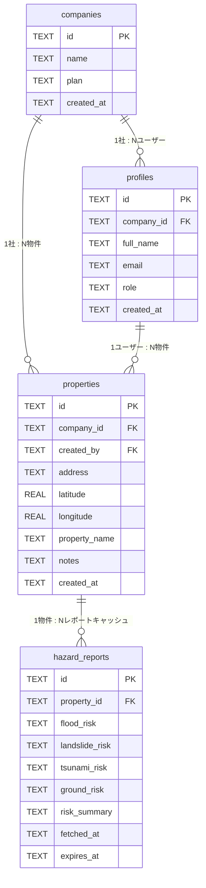

# ER図 — HazardBrief データベーススキーマ

## hazardbrief.db

## テーブル詳細

### companies (会社・テナント)

| カラム | 型 | 説明 |
|--------|-----|------|
| id | TEXT | UUID (random hex) |
| name | TEXT | 会社名 |
| plan | TEXT | プラン (free/standard/enterprise) |
| created_at | TEXT | 作成日時 |

### profiles (ユーザー)

| カラム | 型 | 説明 |
|--------|-----|------|
| id | TEXT | Auth0 ユーザーID |
| company_id | TEXT | 所属会社 FK |
| full_name | TEXT | 氏名 |
| email | TEXT | メールアドレス |
| role | TEXT | 権限 (admin/agent) |
| created_at | TEXT | 作成日時 |

### properties (物件)

| カラム | 型 | 説明 |
|--------|-----|------|
| id | TEXT | UUID |
| company_id | TEXT | 会社 FK |
| created_by | TEXT | 作成者プロファイル FK |
| address | TEXT | 住所 |
| latitude | REAL | 緯度 (ジオコーディング結果) |
| longitude | REAL | 経度 (ジオコーディング結果) |
| property_name | TEXT | 物件名 (任意) |
| notes | TEXT | メモ (任意) |
| created_at | TEXT | 作成日時 |

### hazard_reports (ハザードレポートキャッシュ)

| カラム | 型 | 説明 |
|--------|-----|------|
| id | TEXT | UUID |
| property_id | TEXT | 物件 FK |
| flood_risk | TEXT | 洪水リスク JSON |
| landslide_risk | TEXT | 土砂災害リスク JSON |
| tsunami_risk | TEXT | 津波リスク JSON |
| ground_risk | TEXT | 地盤リスク JSON |
| risk_summary | TEXT | 統合サマリー JSON |
| fetched_at | TEXT | 取得日時 |
| expires_at | TEXT | キャッシュ有効期限 (90日) |

---

最終更新: 2026-03-06
